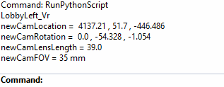

# RhinoCameraConvert
Converts Rhino current viewport camera to a (location + rotation) format that Houdini, TouchDesigner, Disguise, etc. uses.

## How to run?
With Rhino open, use the command `RunPythonScript` and choose the `RhinoCameraConvert.py` file. The resutls will be printed in Rhino Command Line.

